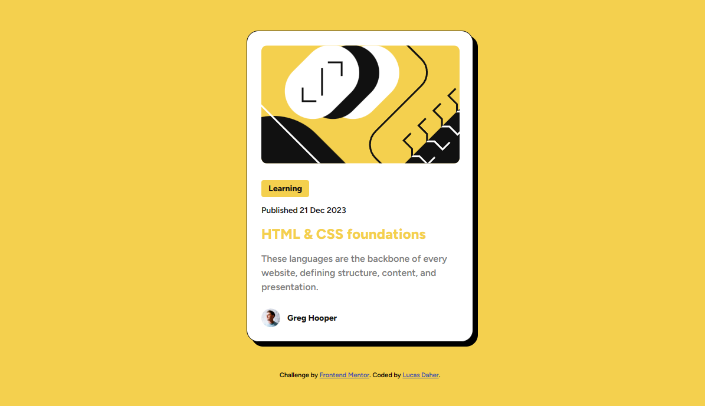

# Frontend Mentor - Blog preview card solution

This is a solution to the [Blog preview card challenge on Frontend Mentor](https://www.frontendmentor.io/challenges/blog-preview-card-ckPaj01IcS). Frontend Mentor challenges help you improve your coding skills by building realistic projects.

## Table of contents

- [Overview](#overview)
  - [The challenge](#the-challenge)
  - [Screenshot](#screenshot)
  - [Links](#links)
- [My process](#my-process)
  - [Built with](#built-with)
  - [What I learned](#what-i-learned)
  - [Continued development](#continued-development)
- [Author](#author)
- [Acknowledgments](#acknowledgments)

## Overview

A simple and responsive card design with HTML and CSS. This is a part of the challenge of Frontend Mentor.

### The challenge

Users should be able to:

- See hover and focus states for all interactive elements on the page

### Screenshot

### Links

- Solution URL: [Github Repository](https://github.com/lucasdaher/blog-preview-card)
- Live Site URL: [Netlify Live Site](https://lucasdaher-blogpreviewcard.netlify.app/)

## My process

I started the project with HTML creating all the necessary divisions and classes and then I styled it with css and aligned it using Flexbox.

### Built with

- Flexbox

### What I learned

I learned how to manipulate the **flexbox** in another type of situation and align the card to the center of the screen regardless of the resolution, making it **responsive**.

### Continued development

Regarding the project, I want to continue delving into responsiveness and flexboxing.

## Author

- GitHub - [My GitHub](https://github.com/lucasdaher)
- Frontend Mentor - [My Frontend Mentor Profile](https://www.frontendmentor.io/profile/lucasdaher)

## Acknowledgments

I get a lot of inspiration from a content creator called **ASMR Prog** ([YouTube ASMR Prog](https://www.youtube.com/@AsmrProg)). Some of his content, even if it is unexplained, ended up helping me at the beginning when I was learning and to this day it has been helping and influencing me a lot.